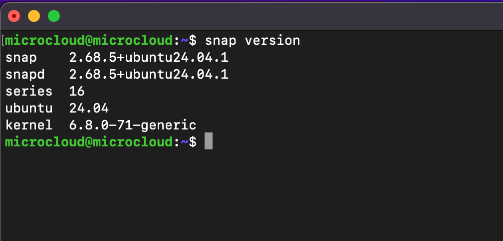
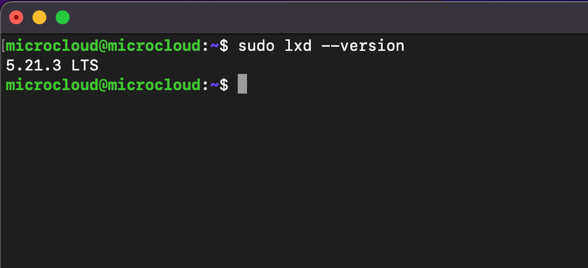
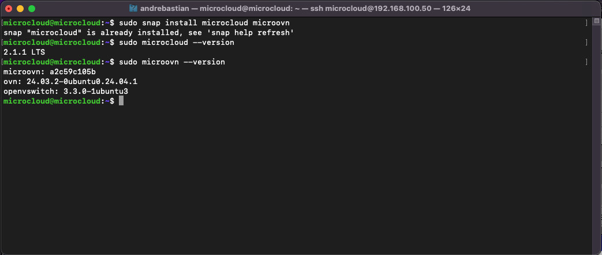
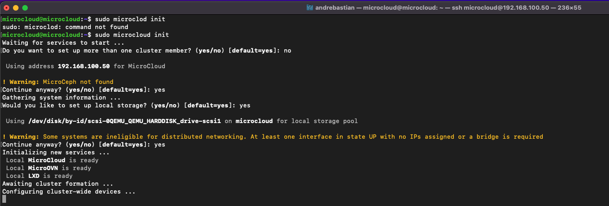

# Microcloud Single Node Installation on Ubuntu 24.04.3 LTS

This documentation describes the installation of Microcloud on a single node running Ubuntu 24.04.3 LTS.

---

## 1. Update and Upgrade Packages

Update your package list and upgrade existing packages:

```bash
sudo apt update
sudo apt upgrade -y
```
---

## 2. Check Snap and LXD Installation

Most Ubuntu installations come with Snap and LXD pre-installed. Check their versions:

```bash
snap version
lxd version
```




If LXD is not installed, install it using Snap:

```bash
sudo snap install lxd
```
---

## 3. Install Microcloud and MicroOVN

Since this is a single node setup, you only need to install Microcloud and MicroOVN (Ceph is not required):

```bash
sudo snap install microcloud microovn
```



---

## 4. Initialize Microcloud

After installing the dependencies, initialize Microcloud with the following command:

```bash
sudo microcloud init
```



---

You have now completed the single node Microcloud installation!