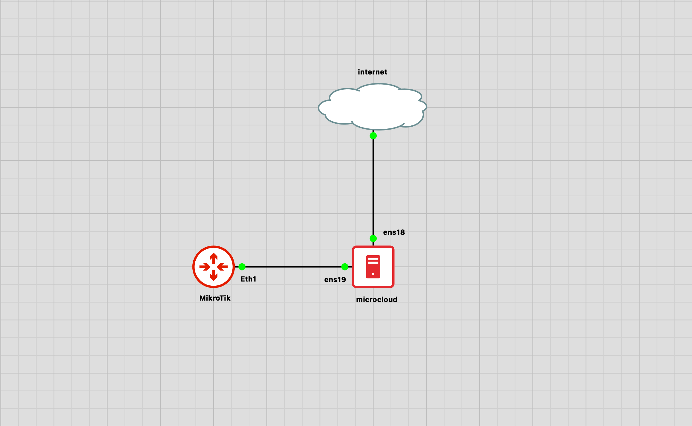

# Microcloud Single Node Installation on Ubuntu 24.04.3 LTS

This documentation describes how to install Microcloud on a single node running Ubuntu 24.04.3 LTS.

---

## 1. Update and Upgrade Packages

Update your package list and upgrade existing packages:

```bash
sudo apt update
sudo apt upgrade -y
```

---

## 2. Check Snap and LXD Installation

Most Ubuntu installations come with Snap and LXD pre-installed. Check their versions:

```bash
snap version
lxd version
```


If LXD is not installed, install it using Snap:

```bash
sudo snap install lxd
```

---

## 3. Install Microcloud and MicroOVN

For a single node setup, install Microcloud and MicroOVN (Ceph is not required):
Since this is you only need to
```bash
sudo snap install microcloud microovn
```


---

## 4. Initialize Microcloud

After installing the dependencies, initialize Microcloud with the following command:

```bash
sudo microcloud init
```


---

You have now completed the single node Microcloud installation!

---

# VLAN Network Configuration

This section describes how to configure a VLAN network and attach it to your Microcloud instance.




## 1. Create VLAN Network (vlan100) Using YAML Configuration

Create a new VLAN network by preparing a YAML configuration file as follows:

```yaml
name: vlan100-eth0
type: physical
config:
    vlan: '100'
    parent: 'ens19'
```

Make sure to set the `parent` to the interface connected to your MikroTik router. Ensure that the VLAN is configured on the MikroTik device.


---

## 2. Network Overview

After creating the network, you will see two new interfaces: `vlan100-eth0` and `ens19.100`.


---

## 3. Attach VLAN Interface to Instance

Attach the `vlan100-eth0` network to your instance (for example, "vm-test").


---

## 4. Interface Overview

Once the interface is attached, you can view the VLAN interface topology.


---

## 5. Test Instance Connectivity

After attaching the interface, check your instance's IP address and test connectivity using ping from the terminal.


---

## 6. Verify Instance Receives IP from MikroTik

Open Winbox and ping your VM's IP address. If the ping is successful, your VM has received an IP from the MikroTik router.


---

## Devices

- **Microcloud**: VM-Proxmox with 4vCPU & 8GB RAM
- **MikroTik**: VM-Proxmox with 2vCPU & 1GB RAM

---

## Link

Origin : https://github.com/andre4freelance/microcloud/tree/main/singelnode
Linkedin post : https://www.linkedin.com/posts/link-andre-bastian_infra-cloud-virtualmachine-activity-7366455292886196224-m2Qy?utm_source=share&utm_medium=member_desktop&rcm=ACoAAD73JlUBty-p-mBfMEW0-O4j0sv-e_PRQvc